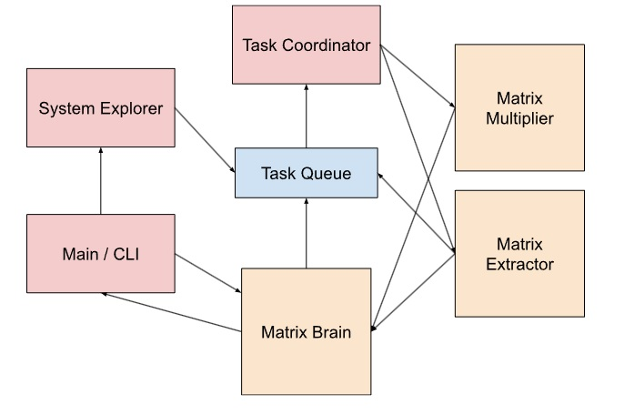

# Multi_thread_Matrix_solver

A university project for parallel a matrix extraction, multiplication system.

# The concurrent system explanation

 
The system idea is that SystemExplorer, TaskCordinator and Main/MatrixBrain are threads, and 
MatrixExtractor, MatrixMultiplier and MatrixBrain have thread pools. 
The SystemExplorer is constantly checking for new files in provided directory (one added with dir command),  
or for changes in existing ones. When it finds changes it adds tasks to the TaskQueue which sends them off to 
the TaskCoordinator which sends of correspondind tasks to MatrixExtractor. The MatrixExtractor concurrently reads 
the file and makes another task which gets added to the TaskQueue and that is calculating the square matrix of the newly 
added matrix. That gets through TaskCordinator again, then to MatrixMultiplier. Both results from MatrixMultiplier and 
MatrixExtractor get send to the MatrixBrain which keeps track of all the extracted and calculated matrices. 
When matrix multiplication is requested through the CLI it gets send to the MatrixBrain and the to the 
TaskQueue->TaskCoordinator->MatrixMultiplier->back to MatrixBrain. Multiplication can be asynchrounous 
(CLI doesn't wait for the result of multiplication) or synchrounous (CLI will wait for the result). How does this 
synchrounous call work? CLI requests synchrounous multiplication, MatrixBrain puts a task as follows and waits on the Matrix 
MatrixBrain->TaskQueue->TaskCoordinator->MatrixMultiplier->MatrixBrain, MatrixBrain gets notified, now does a get on the 
Future object (result of multiplication), receives it and unblocks CLI.  
Multiplication and extraction is done concurrently through thread pools. Extraction is done by splitting rows of file 
on to threads, and multiplication by splitting multiplication of rows onto threads. 
Saveing a file is done through the thread pool as well where one file saveing is given to one thread. The thread pool 
for saveing a file is inside MatrixBrain. 
Stopping of the system is done through poison pills and is zombie safe.

# How to run

Download the project and run it through IntelliJ IDEA or IDEA of choice. 
You can interact with the app through the console. The commands are following:  
 
1. dir dir_name - adds directory to read matrix (.rix) files, also calculates square matrix of every read matrix  
2. info matrix_name - prints out info about the matrix (is case sensitive!) (format of output: [matrix name] RowsxColumns | ready(read from file or calculater) | absolute file path, null if not saved to a file or isnt a matrix read from a file  
3. multiply mat1,mat2 -async -name <name> - multiplies matrices with names mat1 and mat2, -async is optional for asynchrounous calculation, -name also optional for giving a name to the matrix (can fetch values with info <mat_name>)  
4. save -name mat_name -file file_name - saves matrix into a .rix file with a provided name and provided file_name (add .rix at the end)  
5. clear mat_name/file_name - clears data for a matrix with provided name or file name associated with the matrix and all result matrices calculated with this matrix  
6. stop - stops the whole system
